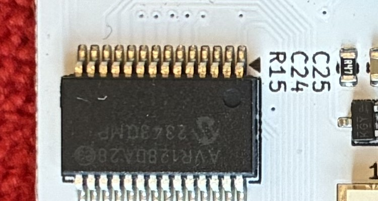
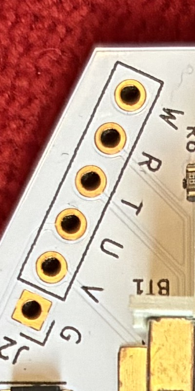

# Tanuki Badge IR Touch Protocol

Badge #266, sitting at 21 pts. Two of these DC NextGen badges can bump each other and both get a point. They do this using infrared light. We want to know exactly what gets sent when that happens. Well enough to fake it.

Done in collaboration with GitHub user [lebowitz](https://github.com/lebowitz). Badge created by Relic, who also gave us some of the hints below in person.

Disclosure: Claude AI was used heavily throughout this, running the scripts, digging up parts, writing most of this doc. It didn't do everything on its own though. We were steering it the whole way.


Back, front, and the board with the case popped open and the screen flipped out.

## Why

If we know what a touch says, we can have a Flipper Zero say it back. Then we could rack up points without needing other badges around. But the fake touch has to actually fool the badge, not just look close. That took a few tries to figure out.

## Where things stand

The badge talks over infrared, the same invisible light a TV remote uses. We expected a Flipper Zero to read that easily. It didn't. Figuring out why became the whole story here.

The Flipper's IR receiver only listens for one blink speed, built into its hardware. This badge blinks at some other speed. Every recording we made came back as junk. Every guess we sent back got ignored. Points stayed at 21 no matter what.

Turns out the real fix wasn't a better sensor at all. It was talking to the person who built the badge. More on that below.

## Tools

A Flipper Zero (updated to firmware 1.4.3 partway through this), and a laptop running small scripts to talk to it over USB.

## Try 1: hit Learn, like teaching a universal remote

The Flipper has a Learn mode for IR: point it at something, press the button, it saves whatever it saw. It doesn't check whether that made any sense. We aimed the badge at it, did a touch, hit Learn. Twice:

```
$ storage read /ext/infrared/Remote.ir
data: 123 125186 135 4012 88
```

```
$ storage read /ext/infrared/Remote2.ir
data: 493 3943 187 1925 240 216 125 428 126 227 125
```

(Both files are saved in this repo as `Remote.ir` and `Remote2.ir`.)

Neither of these is a real signal. A real IR message is dozens of tightly packed blinks, all following one steady rhythm. `Remote.ir` has a gap of 125,186 microseconds sitting between two blips that only last a few hundred microseconds each. That's not a rhythm. That's noise, with a long silence in the middle. `Remote2.ir` is the same story, its gaps jump all over the place.

One more trap: both files say `frequency: 38000`. That looks like a real measurement. It isn't. It's just the number the Flipper writes into every file by default, since the receiver throws away the real speed before the software even sees it. Don't trust that number.

So the receiver wasn't actually hearing the badge. It was just twitching at a speed it doesn't understand. Like tuning a radio to a station that doesn't exist: you get static, not a garbled version of something real.

## Try 2: listen longer, hold the button down

We watched the Flipper's live feed for 25 to 40 second stretches, doing several touches in a row. We also held the badge's little contact button down the whole time, in case it only sends anything while that's pressed. (It does.)

Mostly, nothing. One run caught a 3-blip fragment. A full 25 seconds with the badge held right against the sensor caught zero.

That rules out bad aim. If the receiver could hear this badge at all, holding them together for 25 seconds would catch something steady, not silence one time and three random blips the next. It just can't hear this badge's speed.

## Try 3: throw random signals at it

New question: maybe the badge doesn't check carefully, and any IR blast nearby bumps the counter. Worth testing before doing anything harder. We fired a bunch of standard remote-style signals at it, at six different speeds, a few patterns each, 48 tries total, button held the whole time.

Points stayed at 21. Every single time.

So the badge is checking something before it counts a touch. Probably matching a format, and a checksum. We can't guess our way past that. We need to see a real message first.

## Side note: touching the same badge twice doesn't score twice

Separate from the Flipper testing, we noticed something. Touch the same two badges together a second time, and nothing happens. Only the first meeting between two specific badges scores.

That means each badge remembers who it's already touched, probably by ID number, not just how many touches happened. This matters for our plan: once we know the exact message a real touch sends, replaying that exact same message again and again will likely only ever score once. The badge already has that ID marked off. To keep the score climbing, the replayed message probably needs a different sender ID each time.

## Then we talked to Relic, who built the thing

We met Relic in person, at the DC NextGen party at the Las Vegas Convention Center during DEF CON 34. Relic gave us a few hints that settle some of what was still a guess above, and pointed us at a much better path than the one we were on.

- **It does not use a carrier.** This confirms what comparing our three noise captures already pointed to: not a carrier that's just far from the Flipper's speed, no carrier at all. The badge just switches its IR light on and off directly. No fast blinking underneath. This is exactly why the Flipper's receiver never stood a chance, it expects a carrier to be there.
- **The firmware is not locked.** This removes the one real risk in reading it out. No chance of hitting a locked chip and having to choose between giving up or erasing it. A read should just work.
- **We need a USB-to-UART adapter to read the firmware.** This confirms the plan: a cheap USB adapter can act as a programmer, over a header we found on the board (more on that below).

That third hint changed everything. Instead of building a whole capture rig to guess at the signal from the outside, we can just read the firmware straight off the chip and see exactly what it does. See "Reading the firmware directly" below.

Replaying whatever we learn through the Flipper will still need a different setting than anything we tried in Try 3, since there's no carrier to work with. To fake "no carrier," the LED just needs to stay fully on during each "on" period, instead of flickering at any speed. Worth testing once we know the real message.

## Why the Flipper couldn't do this

The Flipper's IR side is really two separate pieces. Sending is simple, just a plain LED that can be switched at nearly any speed, which is how the speed-sweep in Try 3 worked. Receiving is the hard part: a sealed chip built to only understand one speed, with no way to change it. Turning blinks into data happens inside that chip, before the Flipper's own software even gets involved. Wrong speed in, garbage out.

That's a hardware limit we can't work around from the outside. It's part of why reading the firmware directly turned out to be the better move.

## Popped the case open too


There's a coin battery, and what looks like a small power circuit: a small coil marked `L1`, a bigger one marked `KLJ-1230`, and a small transistor marked `Q2`. This is almost certainly what turns the coin cell's 3 volts into whatever the display needs to redraw. The screen itself is e-paper, meaning it only needs power to change what it shows, and holds the picture with no power the rest of the time. Worth remembering when testing, a slow-changing screen can look like nothing happened when something actually did.

We went back for closer, sharper photos of the two things that mattered most.



The chip: a **Microchip AVR128DA28**. We could read the marking clearly, plus a date code. It's a small computer chip with 128KB of permanent storage and 16KB of working memory. It has no special hardware built in for infrared, so the badge's IR signal is handled entirely by its own software.



There's also an unused six-pin header on the board, labeled `G, V, U, T, R, W`. That reads as Ground, Power, a programming pin, and two more for basic serial communication. Relic confirmed the firmware isn't locked, so this header is our way in.

## Reading the firmware directly

Since Relic confirmed the firmware isn't locked, and told us we'd need a USB-to-UART adapter, this should be a fairly direct read over the header we found on the board.

**What's needed:** a cheap USB-to-UART adapter. Connect its two data wires together through a resistor, and connect that joined point to the badge's `U` pin. Connect the adapter's ground to the badge's `G` pin. This trick is called SerialUPDI. Leave the badge running on its own battery rather than powering it from the adapter, so skip the `V` pin for now.

**Before wiring anything,** double-check which pin is which with a multimeter, rather than trusting our guess from the board's printed labels.

**Software:** a free tool called `pymcuprog`.

```
pip install pymcuprog
pymcuprog ping -d avr128da28 -t uart -u <serial port>
pymcuprog read -d avr128da28 -t uart -u <serial port> -m flash -o 0x0000 -b <size>
```

Only read, don't erase or change any low-level settings. That's the one way this could actually go wrong, one specific setting controls whether that pin can even do this at all, and undoing a mistake there needs special recovery equipment.

A clean firmware read should hand us the exact signal format directly: the timing, the framing, and how the checksum works, without ever needing to guess from the outside.

Once we have that, the plan is: pull out the exact message a real touch sends, figure out the badge's own ID number inside it, and replay it through the Flipper with the contact button held. If that scores, the next problem is the repeat-scoring rule from earlier, since the badge only counts one score per sender ID, we'd need to change that part of the message before each replay to keep the score climbing.

Things that could still complicate this: only having one badge, which makes seeing a real two-badge exchange harder even with the firmware in hand. And a checksum that changes with every touch, using something the firmware alone might not fully explain, like a shared secret or a counter that ticks up outside of what a single read shows.

## Files in here

`Remote.ir`, `Remote2.ir`, and `Remote3.ir`: the junk recordings from Try 1, kept as proof of what doesn't work. `flipper-backup-2026-08-08.tar.gz`: a backup of the Flipper's settings from before its firmware update. `media/`: badge photos and close-ups. `FlipperHIDecoder/`: an unrelated tool we grabbed early on while poking around at what the Flipper can do, not part of this project, kept for reference.

## Appendix: Glossary

Terms that came up along the way, in the order they show up above.

| Term | What it means |
|---|---|
| IR (infrared) | Light your eyes can't see, but a sensor can. |
| Carrier frequency | The speed a signal blinks at, underneath the actual data. Both sides have to agree on this speed to understand each other. |
| Baseband | No blinking at all, just a plain on/off signal. This is what the badge turned out to use. |
| Demodulator | A chip built to understand only one blink speed. The wrong speed comes out as garbage. |
| Mark / space | The "on" and "off" parts of an IR signal. Their lengths usually carry the real data. |
| Checksum | Extra math added to a message so the receiver can tell if it got scrambled. Like a receipt total that has to match its line items. |
| MCU (microcontroller) | The chip in charge, running everything. |
| GPIO | A basic pin on a chip that software can turn on or off, or read. |
| UART | A simple way for two chips to talk, one wire each direction. |
| UPDI | A single wire this chip uses to get reprogrammed, or to have its memory read back out. |
| SerialUPDI | Using a cheap USB adapter, plus one resistor, to do UPDI instead of buying a special programmer. |
| Fuse bits | Special settings stored on the chip that control low-level hardware behavior, like what a pin's job is. |
| Lock bit | One specific setting that can block reading the chip's memory. This badge doesn't have it set. |
| Duty cycle | How much of one on/off cycle is spent "on." 100% duty cycle means always on, no blinking. |
| Boost converter | A small circuit that turns a lower voltage into a higher one. |
| E-paper | A screen that only needs power to change what it shows, then holds the image with no power at all. |
| Flash / SRAM | Flash is a chip's permanent storage. SRAM is its working memory, which clears when the power goes off. |
