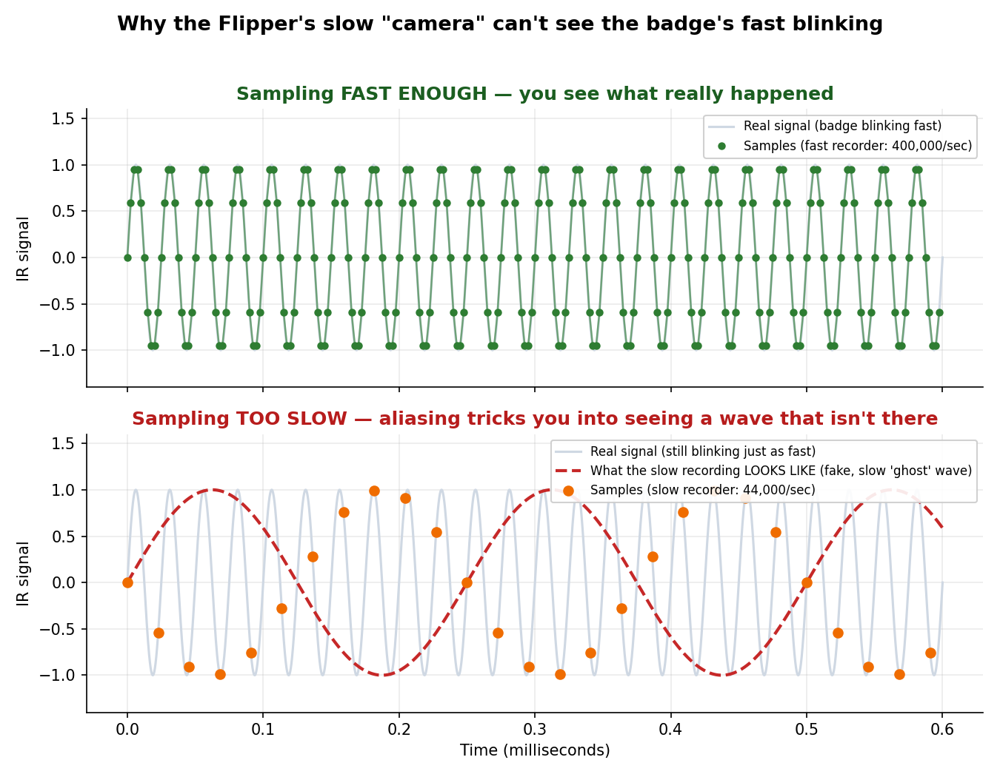

# Tanuki Badge IR Touch Protocol

Badge #266, sitting at 21 pts right now. Two of these DC NextGen badges can bump each other and both get a point over infrared. I want to know exactly what gets sent when that happens, well enough to fake it.


Back, front, and the board with the case popped and the screen flipped out on its ribbon cable.

Disclosure: Claude AI was used heavily throughout this, running the serial scripts, digging up parts, writing most of this doc. It didn't do everything on its own though, we were steering it the whole way.

## Why

If I can figure out what a touch actually says over IR, I can have a Flipper Zero say it back. That means racking up points without a room full of other badges to bump into. Getting there isn't just "look at the signal once" though, the fake touch has to actually pass whatever checks the badge does, or it's just noise to it (see below, this took a few tries to even confirm).

## Where things stand

The badge talks over infrared, same kind of invisible light a TV remote uses. I grabbed a Flipper Zero, figuring it'd read the signal no problem. It did not work at all, and the reason why turned out to be the whole story here.

Short version: the Flipper's IR receiver only listens for one specific blink speed, about 38,000 blinks a second (38 kHz), baked into the hardware. This badge is blinking at some other speed. So every recording I got back was junk, and every guess I fired at the badge in return got completely ignored, pts sat at 21 no matter what I tried.

Fix is a real wideband sensor plus a fast enough recorder to actually see what's going on. Both are ordered, this doc is the notebook until they land.

A few terms if you're newer to this: IR just means light your eyes can't see but a sensor can. Devices don't send IR as one steady beam, they blink it on and off fast, and both sides have to agree on how fast (that speed is the "carrier frequency", in kHz). A demodulator chip is built to only understand one of those speeds, feed it the wrong one and it just outputs garbage. A checksum is extra math tacked onto a message so the receiver can tell if it got scrambled, kind of like a receipt total needing to match the line items, and it's probably why blasting random signals at the badge did nothing. A logic analyzer is a tool that records a wire's on/off state many times a second, basically a super fast flip-book camera for electricity. MCU just means the little computer chip running the show.

## Tools

Flipper Zero (updated to 1.4.3 partway through this), and a laptop talking to it over USB with small Python scripts so tests didn't require standing right over the thing.

## Try 1: just hit Learn, like teaching a universal remote

Flipper has a Learn mode for IR, point it at something, press the button, it saves whatever it saw. Doesn't check if what it saw made any sense. Aimed the badge at it, did a touch, hit Learn. Did this twice.

```
$ storage read /ext/infrared/Remote.ir
name: Magnus
type: raw
frequency: 38000
duty_cycle: 0.330000
data: 123 125186 135 4012 88
```

```
$ storage read /ext/infrared/Remote2.ir
name: RAW_11
type: raw
frequency: 38000
duty_cycle: 0.330000
data: 493 3943 187 1925 240 216 125 428 126 227 125
```

Both saved in this repo, `Remote.ir` and `Remote2.ir`.

Neither of these is a real signal. A real IR message is dozens of tightly packed blinks with one consistent rhythm to it. Look at `Remote.ir`, there's a 125,186 microsecond gap sitting between two blips that are only a few hundred microseconds long themselves. That's not a rhythm, that's noise with a long silence in the middle. `Remote2.ir` is the same story, the gaps between blinks are all over the place.

Also, don't trust that `frequency: 38000` line. It looks like a measurement but it's just the default Flipper writes into every raw capture, because the receiver chip throws away the actual blink speed before the software even sees it. It genuinely cannot report a number it never learned.

So the Flipper's ear wasn't hearing the badge's real signal, it was just twitching because something hit it at a pitch it doesn't understand. Same as tuning a radio to a station that doesn't exist, you get static, not a garbled version of a real broadcast.

## Try 2: listen longer, hold the button down

Watched the Flipper's live raw feed for 25-40 second stretches, doing repeated touches, including holding the badge's little contact button down the whole time in case transmission only happens while it's pressed (spoiler, it does).

Mostly caught nothing. One run got a 3-blip fragment. A full 25 second window with the badge held right against the sensor caught zero blips, not one.

That kills the "bad aim" theory. If the receiver could hear this badge at all, 25 seconds of point blank contact would get something consistent, not silence once and 3 random blips the next time. It just can't hear this pitch, period.

## Try 3: what if I just yell random stuff at it

Worth checking before doing anything harder, maybe the badge isn't picky and any old IR blast near it bumps the counter. Fired a pile of standard remote-style signals at it, six different pitches (30, 33, 36, 38, 40, 56 kHz), a handful of patterns each, 48 combinations total, button held the whole time.

pts stayed at 21 through every single one.

So it's checking something before it counts a touch, probably matching a format and a checksum. Can't brute force past that, I actually have to see a real message first.

## Side note: same badge twice doesn't score twice

Noticed this outside of the Flipper testing. Touch the same two badges together a second time and nothing happens, the counter only moves the first time those two specific badges meet.

That means each badge is remembering who it's already touched, probably by ID, not just counting touch events in general. Bad news for the "farm points solo" plan in one specific way: once I can replay a captured message perfectly, replaying the exact same one over and over will likely only ever score once, because the target badge already has that ID marked off. Getting the points to keep climbing probably means the replayed message needs to claim a different sender ID each time. Something to figure out once the packet's actual fields are visible.

## Why the Flipper couldn't do this

Its IR side is really two separate pieces. Sending is just a plain LED, controllable at more or less any pitch, that part's fine and is how the carrier sweep in try 3 worked. Receiving is a sealed chip hard-wired to one pitch, ~38 kHz, no setting to change it, the "turn blinks into data" step happens inside the chip before the Flipper's software gets any say. Wrong pitch in, garbage out, no amount of aiming or waiting fixes that.

I also looked at whether the Flipper's built-in Logic Analyzer mode could work around it by watching the raw pin directly. It samples around 100,000 times a second, which sounds like plenty until you do the math: catching something blinking 30,000-60,000 times a second cleanly needs several times that sampling rate, or you get a distorted picture instead of a missing one. That's called aliasing, same effect as a spinning wheel looking like it's turning backward on camera because the frame rate can't keep up.



The bottom half of that chart is the trap. Every orange dot is a real, honest measurement of the real gray wave. But because they're spaced too far apart in time, connecting them draws a completely different, much slower red wave that never happened. That's what aliasing actually is, not missing data, confidently wrong data. Top half is what sampling fast enough looks like instead, dense dots tracing the real thing with no fakery, which is the whole reason the new 24 million sample/second analyzer matters here.

## What's getting wired up

From Adafruit ($25.70 total): a [TSMP96000](https://www.adafruit.com/product/5970), a sensor built to hear any IR pitch from 20-60 kHz and pass the raw blinking straight through instead of assuming a fixed speed, plus an adapter cable, jumper wires, and a breadboard.

From Amazon (~$18.50): a USB logic analyzer that samples 24 million times a second, hundreds of times faster than needed, so no more aliasing problem.

Sensor turns the light into an electrical signal, analyzer writes down exactly what that signal did so it can actually be looked at.

## Plan once it all shows up

Wire the sensor to the breadboard, breadboard to the analyzer, common ground. Hold the badge's button, aim it at the sensor, and just look at the trace to finally see the real pitch instead of guessing at it. Catch a few touches, and if a second badge turns up, catch an actual two-badge handshake instead of one badge beaconing alone. Work out the rhythm and framing, find the badge's own ID (`#266`) inside the message, find whatever part changes each time. Then have the Flipper replay the decoded message at the right pitch and watch pts finally move. If that works, loop it and see how fast the counter climbs. Write the real findings up properly with actual signal traces instead of guesses.

Stuff that could still get in the way: only having one badge, which makes catching a real handshake harder. A checksum that changes based on something per-touch, which would mean actually understanding the math instead of just copying a capture. And the chance there's no carrier at all, some IR systems just flicker on and off with nothing fast underneath, the new sensor would still catch that fine but replaying it through something that assumes a carrier might need a different approach.

## Popped the case open too


Coin battery (CR2032), a big black part marked `KLJ-1230` that's probably a coil for the display driver, worth a datasheet search. Two chip packages, one of them's almost certainly the MCU but the markings are too small and blurry in this photo to actually read, need closer sharper shots of both next time. A row of unpopulated holes labeled something like `W R T U V G`, smells like a debug or programming header, worth checking with a multimeter once the chip's identified. The screen itself is almost certainly e-paper, like a Kindle, meaning it only draws power to change what it shows and holds the image with no power otherwise. Worth remembering when testing, if nothing visibly changes right away that might just be a slow screen redraw, not proof nothing happened.

If that chip gets identified from a better photo there's a decent chance its datasheet or even a firmware dump already exists somewhere, which would hand over the carrier and packet format directly instead of having to reverse it from scratch.

## Files in here

`Remote.ir` and `Remote2.ir` are the two junk captures from try 1, kept as proof of what doesn't work. `flipper-backup-2026-08-08.tar.gz` is a Flipper settings backup from before the firmware update. The `media/` photos are the badge front, back, and opened case, plus the aliasing diagram. `FlipperHIDecoder/` is unrelated, a tool I grabbed early on poking around at what the Flipper can do, not part of this project but left in for reference.

---

Done in collaboration with GitHub user [lebowitz](https://github.com/lebowitz).
