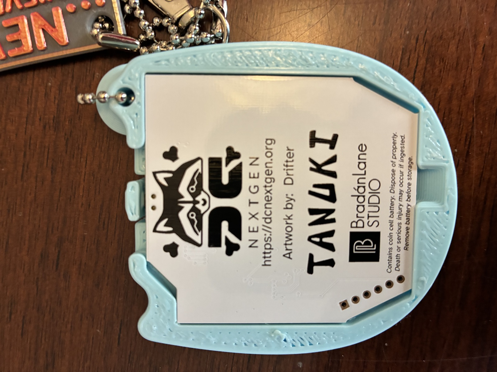
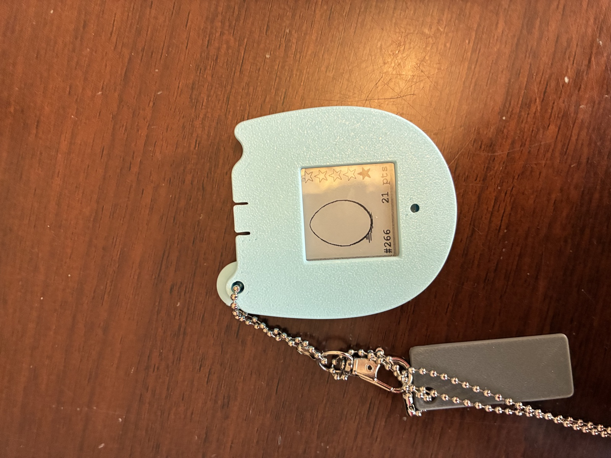
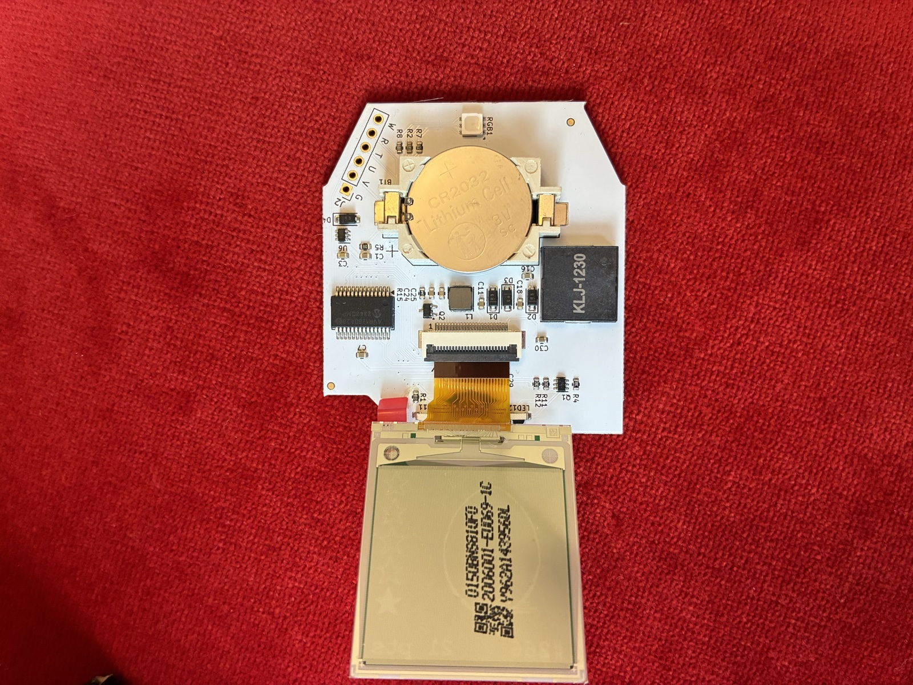

# Cracking the DC NextGen "Tanuki" Badge IR "Touch" Protocol

*Badge #266, 21 pts and counting. Let's find out what's actually flying through the air when two of these things touch.*

## TL;DR

The [DC NextGen](https://dcnextgen.org) "Tanuki" badge does a proximity "touch" with other badges over IR, incrementing an on-screen `pts` counter. I tried to capture and replay that exchange using a Flipper Zero. **The Flipper can't do it** — its onboard IR receiver is a sealed ~38 kHz demodulator, and this badge isn't talking on anything near 38 kHz. Every capture came back as noise, and every blind replay attempt (NEC frames, a 30–56 kHz carrier sweep, multiple encodings) left `pts` sitting at 21. Confirmed the exchange is gated by a physical contact button, which rules out "it's just loose IR presence detection."

Verdict: need real capture hardware. TSMP96000 wideband sensor + a proper logic analyzer are now on order. This repo is the log.

---

## The target

**Correction, logged as-it-happened:** this started life in the writeup as a "r00tz/DEF CON Kids badge." Wrong. Photos of the actual hardware settled it — it's a **DC NextGen** badge ([dcnextgen.org](https://dcnextgen.org)), codename **TANUKI**, artwork by Drifter, built by **BradánLane Studio**. DC NextGen is its own youth program, separate from r00tz Asylum, so the earlier r00tz-firmware search was chasing the wrong project. Leaving the wrong turn in the log below since it's an honest part of the process — just don't trust the "r00tz" framing in Attempts 1–3, only the technical findings.

| | |
|---|---|
|  |  |
|:--:|:--:|
| Back — PCB, coin-cell holder, DC NextGen / TANUKI branding | Front — display: `#266`, `21 pts`, star meter, egg doodle |

- Badge ID `#266`, currently showing `21 pts`, a 5-star meter (4 filled + 1 partial), and a hand-drawn egg/blob icon on what looks like a low-power reflective/e-paper-style display.
- Coin-cell powered (per the back-panel warning label) — worth keeping in mind for the bench rig; this thing isn't going to run forever, and IR TX is one of the hungrier things it can do.
- Has an IR emitter/receiver used for badge-to-badge "touches" — bump two badges together, a spring-loaded **contact button gets physically depressed**, and (apparently) an IR exchange happens that increments both sides' point counter.
- Firmware source not yet located for this badge (searches so far were aimed at the wrong project — see correction above). Next search pass should target **BradánLane Studio** / **DC NextGen** repos specifically. Firmware-reading route is parked, not dead — see **Firmware shortcut** below.

## Tools on hand

- Flipper Zero, stock firmware, updated to **1.4.3** mid-project via `qFlipper-cli` (release channel). Confirmed post-update via `device_info` over serial: `firmware_version: 1.4.3`, hardware ver 15, Official fork.
- macOS box, `pyserial` scripting against the Flipper's CLI over `/dev/cu.usbmodemflip_*` at 230400 baud, since the physical device isn't always within reach mid-session.

---

## Attempt 1 — just learn it like a TV remote

Flipper's IR "Learn" mode will save *anything* it sees as an `.ir` file — it never validates that what it captured is a coherent protocol. Aimed the badge at the Flipper, triggered a touch, saved the result. Twice.

```
$ storage read /ext/infrared/Remote.ir
Filetype: IR signals file
Version: 1
name: Magnus
type: raw
frequency: 38000
duty_cycle: 0.330000
data: 123 125186 135 4012 88
```

```
$ storage read /ext/infrared/Remote2.ir
Filetype: IR signals file
Version: 1
name: RAW_11
type: raw
frequency: 38000
duty_cycle: 0.330000
data: 493 3943 187 1925 240 216 125 428 126 227 125
```

Both files are checked into this repo (`Remote.ir`, `Remote2.ir`) as evidence, byte-verified against the SD card copies (130 and 153 bytes respectively).

**Why these are garbage, not signal:** a real IR frame is dozens of tightly-packed transitions over ~50–70 ms with a consistent bit-period unit. Split `Remote2.ir`'s data into marks/spaces:

```
marks:  493, 187, 240, 125, 126, 125  µs
spaces: 3943, 1925, 216, 428, 227     µs
```

No common divisor, no repeating structure, and `Remote.ir` has a **125 millisecond** gap sitting between two microsecond-scale blips — three orphaned spikes, not a packet. Also worth flagging: `frequency: 38000` / `duty_cycle: 0.33` in both files are **hardcoded defaults** the Flipper writes on every raw learn — the demodulator throws the real carrier away before the CPU ever sees it, so it literally cannot report a measured frequency. Don't trust that field.

**Read:** the sensor glitched. It's not lying about the badge's protocol, it's just malfunctioning against a carrier it can't lock onto.

## Attempt 2 — live capture, longer windows, better aim

Switched to `ir rx` (decoded) and `ir rx raw` (raw edges) over the CLI, live-streamed for 25–40 second windows while triggering repeated touches, including with the badge's **contact button held down** the whole time (in case transmission is gated on contact, which — spoiler — it is).

Results: **mostly nothing.** One run caught a single 3-sample fragment (`404 8448 125`). A 25-second window with the button held the entire time, aimed at point-blank range, caught **zero** frames.

**Read:** this isn't an aiming problem. A receiver that's actually locked onto a signal doesn't intermittently produce zero-to-three-sample fragments over tens of seconds of continuous transmission. The Flipper's IR receiver is *structurally* blind to this carrier.

## Attempt 3 — stop listening, start talking (does the badge care what hits it?)

If we can't decode the real packet yet, cheapest next question: does the badge validate *anything*, or will generic IR nudge the counter? Fired bursts of standard NEC frames (38 kHz) at the badge's receiver window, several code/address combos, badge held in various states.

`pts` stayed at 21. Every time.

Then swept carrier: 30 / 33 / 36 / 40 / 56 kHz, each with a NEC-style preamble+bitframe, multiple duty cycles, while holding the badge's contact button (light-on-press, tone-on-hold — confirmed the button gates the badge into an active/listening state). **48 total TX combinations in one pass** (6 carriers × 2 duty cycles × 4 encodings including a raw payload built from the badge's own ID `0x0266`). Badge reacted once during a broader ad-hoc sweep (worth re-isolating — see Next steps), but bisecting single carriers afterward (36 kHz, 56 kHz) individually produced no reaction and `pts` never moved.

**Read:** this rules out "dumb presence beacon." The badge validates something — almost certainly a packet carrying its own ID plus some kind of checksum — before it'll count a touch. Blind replay isn't going to get there without seeing a real packet first.

---

## Why the Flipper is the wrong tool here (and what isn't)

The Flipper's IR hardware is two separate pieces:

- **TX** — a plain IR LED on a timer, can emit any carrier 10 kHz–1 MHz. This is fine, this is how the carrier sweep worked.
- **RX** — an integrated demodulator (TSOP-style part) **hard-wired to ~38 kHz**, in analog silicon, ahead of anything the firmware can touch. There's no setting to retune it and no way to get raw light out of it. Every "learn" against a non-38kHz source just samples the sensor's own glitching.

Also checked: the [Flipper Logic Analyzer app](https://github.com/g3gg0/flipper-logic_analyzer) (SUMP protocol, works with PulseView) samples GPIO at only **~100 kHz**. Even wired to a proper wideband IR sensor, that's not fast enough to resolve a 30–60 kHz carrier without aliasing (need 2–10x oversampling, i.e. 120 kHz–600 kHz+). So the Flipper can't be the capture instrument for this badge under any configuration — stock or hacked GPIO.

## The fix: real capture hardware

**Ordered — Adafruit ($25.70 incl. shipping/tax):**
- [TSMP96000](https://www.adafruit.com/product/5970) wideband IR sensor breakout — detects 20–60 kHz carriers and, critically, **outputs the modulated signal with carrier intact** (not demodulated) — exactly what a "code learning" application needs and exactly what the badge's Flipper-blind carrier requires.
- [STEMMA JST PH → male header cable](https://www.adafruit.com/product/3893)
- [F/M extension jumper wires, 20×6"](https://www.adafruit.com/product/1954)
- [Half-size breadboard, 400 tie points](https://www.adafruit.com/product/64) — swapped in for the original bundle pick (#3314), which turned out to be discontinued/out of stock.

**Ordered — Amazon (~$18.50):**
- Xicoolee 8-channel USB logic analyzer, **CY7C68013A** chip, 24 MHz, sigrok/PulseView (`fx2lafw` driver — the reference driver was written for this exact chip, so compatibility is a known quantity, not a gamble). Chosen after the SparkFun 24MHz/8ch analyzer (the "obvious" pick) and even Adafruit's original Saleae Logic ($149.50, also the wrong price point) both turned out to be discontinued/out of stock.

At 24 MHz sampling against a ≤60 kHz carrier, that's 400–800x oversampling — plenty of headroom to resolve carrier and bit timing cleanly, unlike the Flipper's 100 kHz ceiling.

*Fallback if I ever want to go Flipper-only:* swap the TSMP96000 for a **TSOP pack (36/40/56 kHz fixed-frequency parts)**. A carrier-matched TSOP hands you an already-demodulated bitstream, which the Flipper's 100 kHz Logic Analyzer app *can* read — you just have to already know (or brute-force by trying each part) which fixed frequency matches.

---

## Plan once hardware lands

1. **Bench setup.** TSMP96000 on breadboard via JST cable (3–5 V, GND, Signal). Signal → Xicoolee analyzer channel, common ground. Install PulseView/sigrok.
2. **Carrier discovery.** Hold contact button, aim badge at sensor, read the carrier frequency straight off the PulseView trace. This is the single fact that's been out of reach the whole session so far.
3. **Packet capture.** Multiple button-hold beacons; if a second badge can be borrowed, capture a **real two-badge touch** — that's the actual validated exchange, not just one side beaconing.
4. **Decode.** Bit period, mark/space encoding, framing. Diff multiple captures to separate the static ID field (should read back as `#266`) from checksum/variable bytes.
5. **Replay via Flipper.** `ir tx RAW F:<measured carrier> ...` with the decoded packet, contact button held, watch `pts` move off 21. That's the win condition.
6. **Write it up.** Carrier, framing, field layout, checksum algorithm, annotated traces.

## Open risks

- **Only one badge on hand.** Might only ever see a lone beacon, not a full two-party handshake, without a second unit.
- **Checksum / anti-replay.** If the payload has a rolling counter or per-partner nonce, static replay won't work and the algorithm needs modeling, not just capturing.
- **Might be baseband, not carrier-modulated at all** (IrDA-style). The TSMP96000 still sees the light either way, but Flipper TX replay assumes a carrier — would need rethinking if so.
- **Re-isolate the "something happened" carrier** from the ad-hoc 48-combo sweep — got a reaction once but haven't pinned which of the 48 caused it. Worth a clean single-variable re-test once real capture hardware confirms the actual carrier anyway (may be moot).

## Firmware shortcut (parallel path, unblocked by hardware)

Haven't yet searched for **BradánLane Studio** / **DC NextGen** firmware repos specifically (earlier searches wrongly targeted r00tz — see correction up top). Worth a pass.

Also popped the case to get a bare-board shot:



What's legible:
- **CR2032** coin cell, socketed, 3V.
- A large black component silkscreened **`KLJ-1230`** — likely an inductor/coil for a boost or e-paper driver stage. Worth a datasheet search.
- Two IC packages (one small SOIC, one larger QFP/SSOP) — one of these is almost certainly the MCU, but the part markings are too small/blurry in this shot to transcribe with confidence. **Need a macro shot of each chip** before this is useful for a datasheet search.
- An unpopulated header silkscreened with letters that read roughly `W R T U V G` — a strong candidate for a debug/programming port. Worth probing with a multimeter (continuity to obvious SWD/JTAG/UART pins on the MCU) once it's identified.
- The panel on the flex cable has a lot-code sticker (`...2009017-C...V962A...`-style string) consistent with an **e-paper/electrophoretic display**, not a simple LCD — matches the grainy, high-contrast look in the front-panel photo. Relevant for testing: e-paper refreshes are slow (hundreds of ms to seconds) and don't need power to hold an image, so a "did the badge react" check needs to give the display time to redraw before concluding nothing happened.

Next step on this path: closer, well-lit macro photos of both IC packages, then ID the chip and go hunting for a datasheet or existing dump — which would hand over the carrier and packet format directly and skip straight to step 5.

---

## Repo contents

| File | What it is |
|---|---|
| `Remote.ir`, `Remote2.ir` | Two learned "captures" from the Flipper — confirmed sensor noise, kept as documented negative examples (see Attempt 1). |
| `flipper-backup-2026-08-08.tar.gz` | Flipper internal storage backup, taken before the 1.4.3 firmware flash. |
| `media/badge-back-pcb.jpg`, `media/badge-front-display.jpg` | Reference photos of the actual badge — back (PCB/branding) and front (display). |
| `media/badge-board-mcu.jpg` | Bare board, case popped, display flipped open on its flex cable — coin cell, ICs, header, e-paper panel. |
| `FlipperHIDecoder/` | Unrelated side-quest — a DEF CON 34 tool for converting ESP-RFID/Proxmark3 HID card dumps to Flipper format. Pulled in during initial exploration of "what's this Flipper thing capable of," kept for reference. |
